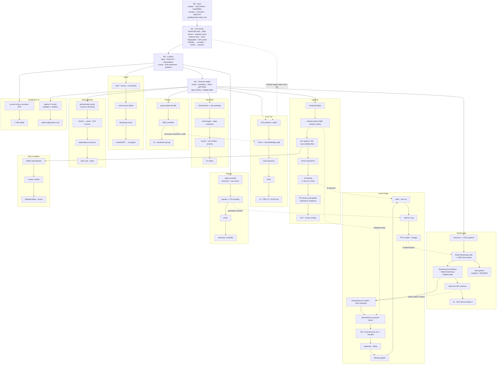

## Critical Path & Build Order

_(Planning, 2026-08-11.)_ The absolute barebones for end-to-end: a game uses the engine, pixels
reach the screen, game logic runs. Everything else branches off naive implementations.

**The golden rule: naive implementations must be contract-shaped.** Every improvement track
below replaces _internals behind an interface that already exists_ — a lighting slot gets fed,
a provider gets swapped, a tier gets added. The skeleton therefore adopts four contracts on day
one, in naive form, because they are cheap now and world-rewrites later:

1. **f64 `Transform.position` + the per-cell offset plumbing** (OQ 30) — with a single implicit
   cell at the origin until streaming arrives. Retrofitting `DVec3` into a shipped World is the
   one migration this document refuses to schedule.
2. **The instance lane** (`DrawId`/`InstanceSlot` allocation, `InstanceData` with fade+flags) —
   PickId, LOD fades, and foliage all stand on slot stability.
3. **The GBuffer contract as specified** — including the shading-model/flag bits in albedo
   alpha and the velocity target (written even before TAA consumes it).
4. **Profiling lanes from the first commit** (OQ 24) — the macros are nearly free, and every
   subsequent milestone is validated through them.

### The Spine (critical path)

- **M0 — Boot.** Window + event loop; `GpuContext` + `Capabilities` probe; the two threads with
  packet, feedback, and control channels; `Engine::run` / `App` / `Time`; profiling lanes.
- **M1 — First pixels.** Minimal World (`Transform`, `MeshRenderer`, `Camera`, `LightSource`);
  `ChangeTracker` → delta extract → retained `RenderScene` (mesh store + instance lane);
  `StagingRef` over a naive one-buffer pool; GPU pools; minimal render graph executing
  GBuffer → lighting (one hardcoded sun, no shadows) → ACES tonemap → present. _No depth
  pre-pass, no HZB, no TAA — all optimizations, none required for correctness._
- **M2 — A game.** Input; `fixed_update` + accumulator + the interpolation contract;
  double-buffered events; Rust-tier behaviors in the `BehaviorHost`; systems + phases.
  A player-controlled entity moves under game logic: the engine/game split is real.
- **M3 — Survives reality.** Resize + staged teardown (a demo that dies on resize is not a
  demo); direct glTF/PNG import at load (the cook cache comes later, behind the same
  `AssetServer` API); egui overlay with the budget table.

After M3 the spine ends; everything else is a branch track with its own naive → improved → v2
chain, joined only by the contracts.

### Build-Order Graph

### Sequencing Notes

- **The Voxel Plugin branches off streaming, not off rendering** — its residency, sources, and
  cell integration are streaming-shaped; its render passes then plug into contracts M1 already
  built. Multi-cell LWC anchors (S4) must land before planet-scale content, not before voxels
  as such.
- **Physics and audio branch off M2** (they serve game logic), rendering tracks off M3.
- **Shadow views (L2) are the multi-view forcing function** — the first consumer of per-view
  culling beyond the main camera; build them before any aux-view feature (probes, RTT).
- **v2 items** (Lumen analog, GPU-driven, FSR, predictive pacing, audio graphs, editor) hang
  off the ends of their tracks — none is load-bearing for any other track's v1, by
  construction (the Deferred Ledger's category-B rounds).
