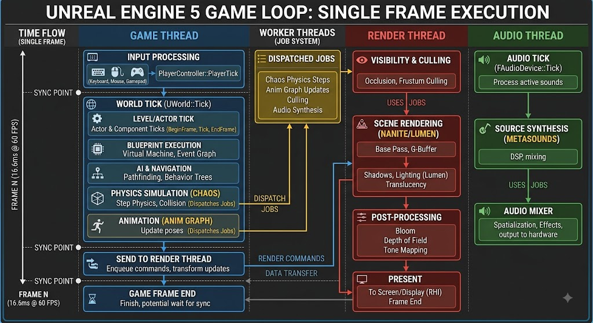

# UE5 Architecture

## Overview

Unreal Engine 5 (UE5) uses a multithreaded architecture where the Game Thread processes game logic and the Render Thread handles visual output. Because the Render Thread cannot safely access Game Thread memory while it is being updated, UE5 relies on a highly structured pipeline of data objects to safely mirror, batch, and execute geometry draws.



## The 3-Frame Pipeline Architecture

In Unreal Engine 5, the default rendering pipeline depth is **3 frames**.

This depth is a direct result of UE5's multithreaded architecture, which parallelizes workloads across the CPU and GPU to maximize performance. Under standard configurations, the engine allows each major stage of the pipeline to operate one frame behind the previous one.

Here is how a single frame (Frame N) propagates through the depth of the pipeline:

- **Step 1: Game Thread (Frame N):** The engine processes game logic, physics, animation, and input for Frame N.
- **Step 2: Render Thread (Frame N+1 time):** The Game Thread moves on to process Frame N+1. Concurrently, the Render Thread takes the data from Frame N to process visibility, culling, and draw command generation.
- **Step 3: RHI / GPU Execution (Frame N+2 time):** The Game Thread starts Frame N+2, the Render Thread processes Frame N+1, and the GPU executes the hardware rendering commands to finally present Frame N to the screen.

This staggered approach means that an input received on the Game Thread during Step 1 will typically be reflected on-screen at the end of Step 3. This introduces an inherent baseline latency in exchange for a significantly higher, stable framerate.

### Controlling Pipeline Depth

Depending on your project's performance and latency targets, you can modify this depth:

- **`r.OneFrameThreadLag`:** This console variable is enabled (`1`) by default. If you disable it (`r.OneFrameThreadLag 0`), you force the Game Thread to wait for the Render Thread to finish before moving on. This reduces the pipeline depth to **2 frames**, lowering input latency. However, it severely bottlenecks performance because the Game and Render threads can no longer run concurrently.
- **Maximum Frame Latency:** The GPU itself can sometimes buffer commands if the CPU is running much faster than the GPU can render. The RHI limits how far ahead the CPU can get (usually 1 frame).
- **Latency Reduction Technologies:** For input-critical projects, integrating SDKs like **NVIDIA Reflex** helps dynamically pace the CPU to the GPU. This ensures the Game Thread doesn't sample input and run ahead faster than the GPU can keep up, effectively keeping the pipeline depth as tight as possible without sacrificing multithreaded throughput.

## The Render Thread

In the following we provide a highly detailed, structured breakdown that acts as a "zoomed-in" diagram of the Unreal Engine 5 Render Thread.

In UE5, the Render Thread is responsible for taking the scene state prepared by the Game Thread and translating it into a complex sequence of rendering passes. It heavily utilizes the Job System (Worker Threads) to parallelize tasks like culling, and ultimately feeds the RHI (Render Hardware Interface) thread to dispatch GPU commands.

Here is the detailed pipeline of the UE5 Render Thread during a single frame.

### 1. Init Views (Visibility & Setup)

Before anything is drawn, the engine must determine exactly what the camera can see to avoid wasting GPU cycles on hidden objects. This is traditionally one of the most CPU-heavy parts of the Render Thread, though UE5 offsets much of it to the GPU via Nanite.

- **Distance & Frustum Culling:** Discarding objects outside the camera's view or past their maximum draw distance.
- **Occlusion Culling (HZB):** Using a Hierarchical Z-Buffer (from the previous frame's depth) to determine if objects are hidden behind other larger objects (like a building hiding a car).
- **Nanite Setup:** The CPU determines which Nanite instances are visible and dispatches a compute shader to the GPU. **Nanite handles its own micro-culling on the GPU**, bypassing much of the traditional CPU overhead.
- **Shadow Setup:** Determining which lights need to cast shadows this frame and allocating pages for Virtual Shadow Maps (VSMs).

### 2. The Pre-Pass (Depth Only)

This pass establishes the depth of the scene early on. By calculating what is in front and what is behind, the engine prevents "overdraw" (calculating expensive lighting/materials for pixels that will eventually be covered up).

- **Early Z / Depth Pass:** Traditional static and dynamic meshes render their depth information to the Z-buffer.
- **Nanite Rasterization:** Nanite geometry is rasterized via compute shaders into a specialized visibility buffer. This buffer stores tiny IDs indicating which triangle belongs to which pixel, drastically reducing the bandwidth needed for heavy geometry.

### 3. The Base Pass (G-Buffer Generation)

This is where the visible surfaces of opaque objects are drawn and their material properties are written to the **Geometry Buffer (G-Buffer)**. UE5 uses deferred rendering, meaning it separates the drawing of geometry from the calculation of lighting.

| G-Buffer Target | Typical Data Stored                                     |
| --------------- | ------------------------------------------------------- |
| **Scene Color** | Emissive outputs, Pre-computed lighting (if any)        |
| **G-Buffer A**  | World Space Normals (which direction the surface faces) |
| **G-Buffer B**  | Metallic, Specular, and Roughness values                |
| **G-Buffer C**  | Base Color (Albedo) and Ambient Occlusion               |
| **Scene Depth** | The final Z-Buffer depth                                |

_Note: For Nanite objects, the engine uses the visibility buffer created in the Pre-Pass to emit G-Buffer data only for the visible pixels, making it incredibly efficient._

### 4. Lighting & Shadows (Lumen Integration)

With the G-Buffer filled with material data and depth, the Render Thread now calculates how light interacts with those materials.

- **Virtual Shadow Maps (VSMs):** The engine renders depth from the perspective of the lights. VSMs cache static shadows and only update the "pages" where dynamic objects move, allowing for extremely high-resolution shadows.
- **Lumen Scene Update:** The simplified representation of the world (Surface Cache or Hardware Ray Tracing BVH) is updated with any moved objects or changed materials.
- **Direct Lighting:** Calculating the immediate impact of directional lights, point lights, and spotlights on the G-Buffer.
- **Lumen Global Illumination & Reflections:**
- **Screen Traces:** Rays are traced against the on-screen depth buffer.
- **Distance Fields / Hardware Ray Tracing:** If a ray misses the screen, it traces against the Lumen Scene to calculate bounce lighting and accurate reflections.

- **Composite:** The direct lighting, indirect lighting (Lumen), and sky lighting are combined and applied to the base color of the scene.

### 5. Translucency & Volumetrics

Opaque objects are finished, but elements that allow light to pass through them must be rendered on top. Because they do not write to the depth buffer in the same way, they cannot be part of the deferred Base Pass.

- **Volumetric Fog & Clouds:** Calculating ray-marched volumetrics based on the lighting data.
- **Translucent Materials:** Glass, water, and particle effects are sorted from back-to-front and drawn over the opaque scene. Translucency can sample the Lumen volume for lighting but is generally more expensive to light than opaque surfaces.

### 6. Post-Processing

The 3D scene is fully rendered into a 2D image, and camera-lens effects are applied.

- **Temporal Anti-Aliasing (TAA) / Temporal Super Resolution (TSR):** UE5 compares the current frame with previous frames, using motion vectors to smooth jagged edges and intelligently upscale the image from a lower internal rendering resolution to a higher display resolution.
- **Lens Effects:** Depth of Field (blurring objects out of focus), Bloom (light bleeding from bright sources), and Lens Flares.
- **Tone Mapping & Color Grading:** Converting the High Dynamic Range (HDR) lighting values into the Standard Dynamic Range (SDR) or specific HDR format your monitor can display, alongside applying final cinematic color corrections.

### 7. RHI Thread & Present

The Render Thread has finished organizing all the draw calls and passes.

- **Command Translation:** The generic rendering commands are handed to the Render Hardware Interface (RHI) thread, which translates them into API-specific instructions (DirectX 12, Vulkan, or Metal).
- **GPU Execution:** The GPU processes the command list.
- **Swapchain (Present):** Once the GPU finishes, the newly rendered frame is swapped with the currently displayed frame, and the image finally appears on the screen.

## Hybrid Rendering

In Unreal Engine 5's real-time rendering pipeline, the rasterization pass and the ray tracing passes are distinct, separate steps.

UE5 utilizes a **hybrid rendering architecture** for its real-time graphics. It relies on rasterization for primary visibility (what the camera sees directly) and hardware ray tracing for secondary effects (how light bounces, reflects, and casts shadows).

_(Note: UE5 also includes a Path Tracer, which is a fully ray-traced rendering mode. However, this is primarily used for offline rendering or high-quality architectural visualization, not real-time gameplay.)_

The rasterization pass _writes_ to the G-Buffer, whereas the ray tracing passes _read_ from the G-Buffer.

Ray tracing passes output their results into separate, dedicated render targets (like a global illumination buffer or a reflections buffer), which are later combined with the rest of the scene.

Here is the step-by-step flow of how rasterization and ray tracing interact during a single frame:

**1. The Base Pass (Rasterizing the G-Buffer)**
First, the engine uses traditional deferred rendering (via Nanite or standard draw calls) to rasterize the scene's geometry from the camera's point of view. This pass computes the primary visibility and writes all the material properties—such as Depth, World Normals, Albedo (Base Color), Roughness, and Metallic—into the G-Buffer.

**2. The Acceleration Structure (TLAS/BLAS)**
Simultaneously, the engine maintains and updates a bounding volume hierarchy (BVH) on the GPU, known as the Top-Level Acceleration Structure (TLAS). This structure contains a simplified spatial map of all the ray-traceable geometry in the level so the GPU's ray tracing cores can efficiently calculate intersections.

**3. Ray Dispatching (Secondary Rays)**
When it is time to calculate lighting, reflections, or shadows, the engine executes compute shaders. Instead of shooting rays blindly from the camera, these shaders **read the G-Buffer**. By sampling the depth and normal of a specific pixel on the screen, the shader knows exactly where a surface is in 3D space and which way it is facing.

**4. Tracing and Hit Shading**
Using the G-Buffer data as the origin point, the engine casts rays out into the TLAS.

- **For Reflections:** A ray is bounced off the surface based on the G-Buffer's normal and roughness values to find what is reflected.
- **For Shadows:** A ray is traced from the surface directly toward a light source to see if anything is blocking it.
- **For Global Illumination (Lumen):** Rays are cast outward to sample bounced indirect lighting.

When a ray hits an object in the TLAS, it calculates the lighting and material data at that intersection (often querying Lumen's Surface Cache or triggering a material hit shader).

**5. Compositing**
The data gathered from the ray tracing passes is written into separate lighting buffers. Finally, the deferred rendering pipeline takes the G-Buffer's base colors, applies the traditional direct lighting, and composites the ray-traced indirect lighting and reflections over the top to produce the final lit image.

## Data Structures

In the following we present a breakdown of the specific data structures UE5 uses to prepare geometry for the Render Thread, moving from high-level abstractions down to GPU resources.

### 1. The Proxy System (Bridging the Threads)

The proxy system is the core mechanism that decouples Game Thread components from Render Thread execution.

- **`FPrimitiveSceneProxy`**: This is the fundamental Render Thread representation of a Game Thread `UPrimitiveComponent`. It acts as a mirror that contains all the mesh data, material references, and rendering state needed to submit draw calls. Once created and registered, the Game Thread can no longer touch its memory.
- **Derived Proxies**: Base proxies are specialized for specific geometry types, such as `FStaticMeshSceneProxy` for standard static meshes or custom proxies written for unique rendering implementations like procedural terrain.
- **`FPrimitiveSceneInfo`**: This structure is the scene's internal representation of a primitive. It contains the actual `FPrimitiveSceneProxy` pointer and a unique `PrimitiveSceneId` that the scene uses to track the geometry in spatial acceleration structures and internal arrays.
- **`FPrimitiveSceneDesc` & `FPrimitiveSceneProxyDesc**`: These are parameter structs acting as data packets. They contain everything needed to create a scene proxy or notify the scene of an update, including transformation matrices, bounding volumes, and shadow-casting flags.

### 2. The Mesh Drawing Pipeline

UE5 utilizes a retained-mode rendering pipeline that aggressively caches geometry when possible, while supporting dynamic generation for moving or changing elements.

- **`FStaticMeshRenderData`**: A container holding all the pre-processed, platform-independent data required to render a static mesh (like LODs and raw vertex data).
- **`FMeshBatch`**: This structure decouples the user proxy implementation from the renderer's private mesh passes. It holds everything a pass needs to determine final shader bindings and render states. Proxies submit these via callbacks like `GetDynamicMeshElements` for geometry that changes frame-to-frame, or `DrawStaticElements` for cached, static draws.
- **`FMeshBatchElement`**: Housed within a `FMeshBatch`, this struct represents an array of individual elements (like separate mesh sections or LOD slices) that are scheduled to be drawn.
- **`FMeshDrawCommand`**: Generated from an `FMeshBatch` by an `FMeshPassProcessor`, this is a fully stateless description of a draw call. It stores exact shader resource bindings and draw parameters, which allows UE5 to aggressively merge and cache draw calls just above the hardware level.

### 3. Render Hardware Interface (RHI) Resources

Once the geometry is batched, the data must be formatted for the GPU.

- **`FRenderResource`**: The base interface for rendering resources, which handles hooks for initialization and releasing. These resources can only be initialized on the Render Thread.
- **`FVertexBuffer` & `FIndexBuffer**`: Derived from `FRenderResource`, these low-level buffers hold the raw positional, normal, and indexing data. If you are updating vertex positions dynamically (like in GPU skinning), these buffers are locked and updated via unique render commands.
- **`FCustomPrimitiveData`**: An array of floating-point data (typically 4-byte aligned for GPU efficiency) that gets uploaded directly to the GPU. This structure allows developers to pass arbitrary float data to materials, enabling per-instance variations without needing to compile unique material instances.

### 4. UE5-Specific Advanced Geometry Structures

For more specialized modern rendering features, UE5 implements additional paradigms outside the traditional `FMeshBatch` pipeline:

- **Nanite Structures (`FCluster`, `FPage`, `FHierarchyNode`)**: For Nanite geometry, UE5 does not use the standard `FMeshDrawCommand` pipeline for the main pass. Instead, it serializes static meshes into directed acyclic graphs (DAGs) of micro-polygon clusters. These are packed into hardware buffers and streamed into pages, relying on compute shaders for continuous level-of-detail (LOD) and culling directly on the GPU.
- **`FDynamicMesh3`**: A highly mutable, half-edge data structure introduced via Geometry Scripting. While it exists primarily on the Game Thread/Worker Threads for real-time procedural generation and editing, it is converted into render-friendly buffers and submitted to the Render Thread via an `FDynamicMeshSceneProxy`.

## Customizing the Render Pipeline

Unreal Engine 5’s rendering architecture is designed to be highly modular, allowing developers to inject, customize, or completely replace specific pieces of the rendering pipeline while still relying on the engine's RHI (Render Hardware Interface) to handle the underlying API translation (DirectX, Vulkan, Metal, etc.).

Because the RHI abstracts away the hardware-specific implementations, you can write custom rendering logic that works cross-platform by default. Here is a breakdown of how deeply you can customize the rendering pipeline, moving from geometry submission down to the macro-frame loop.

### 1. Data Submission & Representation (`FPrimitiveSceneProxy`)

As you noted, the proxy is where you take complete control of how your geometry is represented on the Render Thread. By writing a custom `FPrimitiveSceneProxy`, you can bypass standard static or skeletal mesh structures entirely. You can allocate your own vertex buffers, define custom culling bounds, and manually build the `FMeshBatch` elements that the pipeline will consume.

### 2. Draw Call Generation (`FMeshPassProcessor`)

If you want to change _how_ your custom geometry is processed by the engine's standard passes (like the Base Pass, Depth Pass, or Shadow Pass), you can write a custom `FMeshPassProcessor`. This processor dictates how an `FMeshBatch` is translated into an actual `FMeshDrawCommand`. It allows you to inject custom shader bindings, modify pipeline state objects (PSOs), or completely discard certain geometry from specific passes.

### 3. Pipeline Injection (`ISceneViewExtension`)

If you need to add entirely new stages to the frame—rather than just modifying how geometry is drawn—you use a **Scene View Extension (SVE)**. SVEs allow you to hook into various phases of the rendering pipeline to implement custom rendering passes without modifying engine source code. Through SVE callbacks, you receive a reference to the `FRDGBuilder` (Render Dependency Graph builder), which allows you to schedule your own compute or raster passes at specific injection points, such as before post-processing or after the Base Pass.

### 4. Custom Passes & Shaders (Render Dependency Graph - RDG)

When injecting your SVE passes, you use the **RDG**. The RDG is a graph-based API that schedules and executes rendering tasks. By writing custom Global Shaders (C++ classes paired with `.usf` files), you can build complex compute shader logic—like custom voxel ray-marching or fluid simulations—and let the RDG automatically handle all the transient memory allocation, resource barriers, and synchronization on the GPU.

### 5. Replacing the Macro Pipeline (`FSceneRenderer`)

If you are doing something incredibly extreme and have engine source access, you can technically bypass the default `FDeferredShadingSceneRenderer` or `FMobileSceneRenderer`. The engine's rendering loop delegates the actual frame execution to a subclass of `FSceneRenderer`. While highly complex and difficult to maintain across engine updates, you could theoretically write an entirely bespoke scene renderer that executes a completely different pipeline (like a pure forward renderer or a custom hardware ray-tracing loop).

## The Blueprint Visual Scripting System

In Unreal Engine, the Blueprint system is a fully-featured, node-based visual scripting language. It allows developers to create gameplay functionality, UI, and complex systems by connecting graphical nodes with wires, rather than typing traditional code.

### Architecture and Execution

From a systems architecture perspective, Blueprints act as an object-oriented scripting layer on top of the engine's C++ core.

- **Virtual Machine:** Each Blueprint is compiled down into bytecode, which is then executed at runtime by the Blueprint Virtual Machine.
- **C++ Interop:** The system is designed for tight integration with native C++. Engine programmers can write optimized base classes and expose specific variables or functions using macros (like `UPROPERTY`), allowing developers and designers to safely extend that logic visually.
- **Execution Flow:** Logic is strictly driven by execution pins (white wires) flowing from left to right, ensuring a node only runs when explicitly triggered. Typed data (such as floats, booleans, arrays, structs, and object references) is passed concurrently between nodes via colored data pins.

### Core Blueprint Types

Depending on the architectural need, the engine utilizes five primary types of Blueprint assets:

- **Blueprint Class:** The standard object-oriented class that acts as a "recipe" for an Actor. It encapsulates physical components (like static meshes or colliders), variables, and graph logic. They can also exist as "Data-Only" classes, which contain no execution logic and simply override properties inherited from a parent C++ or Blueprint class.
- **Level Blueprint:** A global event graph automatically generated for every individual map, handling level-specific logic and actor references.
- **Blueprint Interface:** A collection of function declarations that lack implementation. When implemented by a Blueprint Class, it allows for polymorphic communication, enabling different types of objects to send and receive data through a shared contract.
- **Blueprint Function Library:** A container for static functions that do not store local state. Because they don't retain memory of a specific instance between calls, they are ideal for general-purpose utility or mathematical logic that operates on inputs and returns results.
- **Blueprint Macro Library:** A collection of reusable node graphs (macros) that expand directly into the Blueprint where they are called. These are excellent for custom execution flow control.

### Graph Environments

Within a Blueprint Class, logic is typically divided into two main environments:

- **Construction Script:** This logic executes when an Actor is initialized or modified in the editor. It is heavily used for procedural generation, dynamically setting static meshes based on data structures, or arranging components before runtime.
- **Event Graph:** This environment contains the logic that executes during actual gameplay. It handles the logic path for real-time events, such as player inputs, combat calculations, AI decisions, or collision overlaps.

### The C++ Approach

A game in Unreal Engine 5 does not need to use Blueprints for its gameplay logic. You can build a complete game entirely using C++, but the practical reality of how the engine handles asset management usually dictates a hybrid

Unreal Engine is fundamentally a C++ engine, and the Blueprint Virtual Machine sits on top of it. Therefore, anything that can be done in Blueprints can be done in C++ (usually with much better performance).

If you want to write a game strictly in C++, you would:

- Define all your Actors, Components, and Game Modes in C++ classes.
- Handle all input binding and physics calculations natively.
- Bind UI events and delegate callbacks directly in code.

**The Pragmatic Reality (Data-Only Blueprints):**
While you _can_ hardcode the file paths to your 3D models, sounds, and particle effects directly in C++ (using `ConstructorHelpers::FObjectFinder`), this is heavily discouraged. If an artist renames or moves a folder, your C++ code will break, requiring a full recompile.

Instead, the standard industry practice—even for games that write 100% of their logic in C++—is to use **Data-Only Blueprints**. You create a C++ class with your logic, and then create a Blueprint derived from that class. You don't put any visual nodes in this Blueprint; you simply use the editor's detail panel to assign the meshes, materials, and audio files to the variables you exposed from C++.

---

It is incredibly common for systems architects and engineers to bounce hard off the Blueprint editor. When you are used to the speed of typing, version control diffs, and clean code architecture, manually dragging wires and aligning nodes can feel like tying your shoelaces with tweezers.

The actual strength of Unreal Engine is **the composability of its underlying architecture, not the visual editor itself.**

The Blueprint visual editor is just a graphical frontend for the `UObject` reflection system. You can completely bypass the "clicking" while keeping all of the modular, graph-like composability by leaning into a strict C++ workflow.

#### 1. The Component-Based Graph in C++

The core composability you like is driven by the Actor-Component model. You can build this entire hierarchical graph in your C++ constructors. Instead of dragging a mesh, a collider, and a light into a visual editor, you define the tree in code:

```cpp
// In your C++ Actor Constructor
RootComponent = CreateDefaultSubobject<USceneComponent>(TEXT("Root"));

MyMesh = CreateDefaultSubobject<UStaticMeshComponent>(TEXT("VisualMesh"));
MyMesh->SetupAttachment(RootComponent);

MyCollider = CreateDefaultSubobject<USphereComponent>(TEXT("Collision"));
MyCollider->SetupAttachment(MyMesh); // Graph composition happens here

```

This gives you the exact same modularity—snapping components together to build complex entities—but it lives entirely in plain text.

#### 2. Treating Blueprints strictly as Data (Data-Driven Design)

To avoid hardcoding asset paths (like `"/Game/Meshes/PlayerMesh.uasset"`) in your C++, you use a hybrid approach called **Data-Only Blueprints**.

In this paradigm, you write 100% of your execution logic, state machines, and component hierarchies in C++. Then, you create a Blueprint derived from your C++ class. You never open the visual node graph. Instead, you treat the Blueprint exactly like a JSON or YAML configuration file. You use its details panel simply to assign the 3D models, audio files, and tunable variables (like speed or health) to the properties you exposed from C++.

#### 3. The Gameplay Ability System (GAS)

If you want the ultimate example of composable architecture in UE5 without spaghetti node graphs, you look at the **Gameplay Ability System (GAS)**.

GAS is a highly robust, data-driven C++ framework designed for building complex RPG-style attributes, buffs, debuffs, and abilities. It uses "Gameplay Tags" (hierarchical strings like `Status.Debuff.Stun`) and "Gameplay Effects" to create a highly modular, graph-like interaction system. You can compose intricate chains of logic (e.g., "Fireball applies a burning tag, which interacts with the target's armor attribute to reduce health over time") entirely through data tables and C++ classes, bypassing the need for visual scripting almost entirely.

---

The visual scripting is a great tool for rapid prototyping or for giving designers a sandbox, but treating the engine as a strict C++ framework with data-driven configuration files is how most large-scale, performance-heavy projects are actually built.

## Describing a Game

At its core, describing a game in Unreal Engine 5 is about assembling a strict hierarchy of objects, data, and logic within the engine's built-in **Gameplay Framework**. Rather than writing a monolithic game loop from scratch, you populate Epic’s predefined architecture.

### 1. The Core Hierarchy (Actors & Components)

Every physical or logical entity in a UE5 world is built using a composition-over-inheritance model, heavily utilizing components.

- **Actors (`AActor`):** The base object that can be spawned or placed in a level. An Actor by itself is essentially an empty container.
- **Actor Components (`UActorComponent`):** These promote a modular architecture by encapsulating specific functionality, allowing you to add features like an inventory system to an Actor.
- **Scene Components (`USceneComponent`):** These extend base components by adding physical attributes like a 3D transform (position, rotation, scale) and mobility settings. Static Meshes and Cameras are standard Scene Components.

### 2. The Gameplay Framework (Rules & State)

UE5 expects games to adhere to specific state machines and controller paradigms to handle the flow of the game and multiplayer replication.

- **GameMode:** This class defines the fundamental rules of the match and handles multiplayer functionality, such as player connections and spectating. It only exists on the server.
- **GameState:** This serves as the primary way to communicate match status, player connections, and other game-wide information from the GameMode down to all connected clients.
- **Controllers & Pawns:** A `PlayerController` translates physical human input into game actions. It "possesses" a `Pawn` (or `Character`), which is the physical avatar in the world.
- **AI Components:** For non-player characters, a `BrainComponent` executes Behavior Trees and Environment Query Systems (EQS) for decision-making. Navigation is handled by a `PathFollowingComponent`.

### 3. Logic & State Management

Game logic is distributed across classes using either C++ or the Blueprint visual scripting virtual machine. Lifecycle and global data are managed via Subsystems.

- **Engine & GameInstance Subsystems:** These manage persistent, cross-level logic and are created when the engine starts or the game session begins.
- **World Subsystems:** These are created alongside a specific level and are highly useful for managing level-specific logic that doesn't need to persist or replicate.

### 4. World Building (Levels)

A level (`UWorld`) is the 3D container that holds all Actors. The way UE5 handles level data depends on the scale of the game.

- **Basic Levels:** Standard levels load as single files. You can utilize Level Streaming to separate different disciplines—like audio, lighting, and geometry—into distinct map files for team collaboration.
- **Open World (World Partition):** Enabling Open World features activates World Partition, which automatically unloads data based on camera distance. This system relies on One File Per Actor (OFPA), shifting level management from large monolithic files to individual text files for every single Actor.

### 5. Assets & Rendering Data

Visuals are authored in external Digital Content Creation (DCC) tools and imported as distinct asset packages (`.uasset`).

- **Meshes:** 3D models are imported as Static Meshes (rigid geometry) or Skeletal Meshes (geometry bound to a bone hierarchy for animation).
- **Materials & Textures:** Textures are imported as 2D images. Materials are constructed using a node-based shader graph, which the engine compiles into HLSL for the Render Thread to execute.

### 6. User Interface (UMG & Slate)

Menus, HUDs, and inventory screens are built using a two-layered UI architecture.

- **Slate:** This is Unreal’s custom, low-level C++ UI framework, which is also used to build the entire Unreal Editor itself. Slate uses a declarative syntax built with imperative C++ concepts. To maximize developer efficiency and avoid opaque caching issues, Slate prefers to poll data directly every frame rather than relying on complex event notifications.
- **UMG (Unreal Motion Graphics):** UMG is a Blueprint-friendly superset built directly on top of Slate. It provides a visual, drag-and-drop designer for artists and designers to author interfaces without writing C++.
